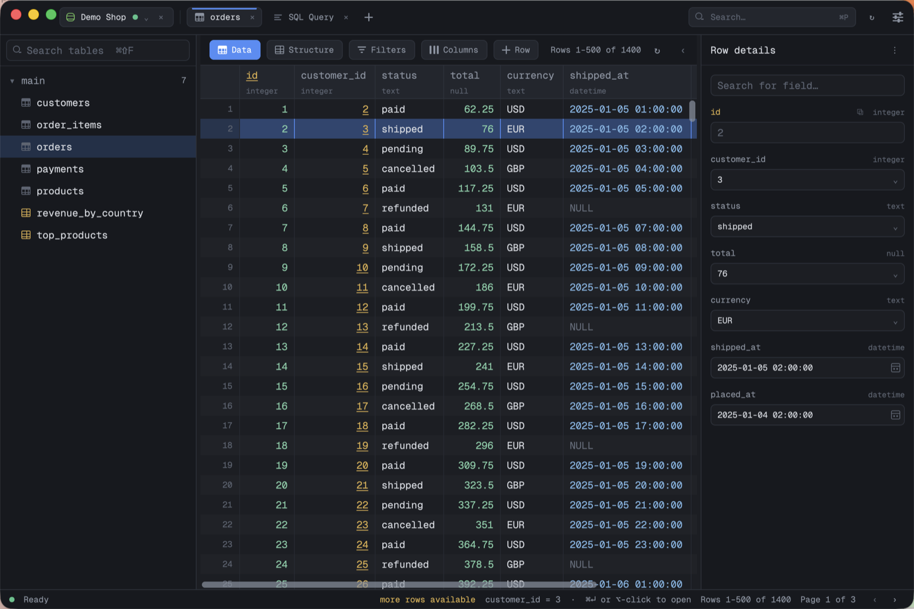
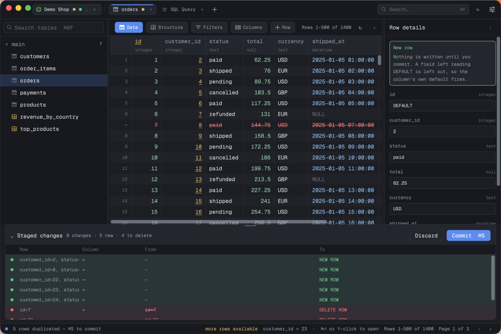
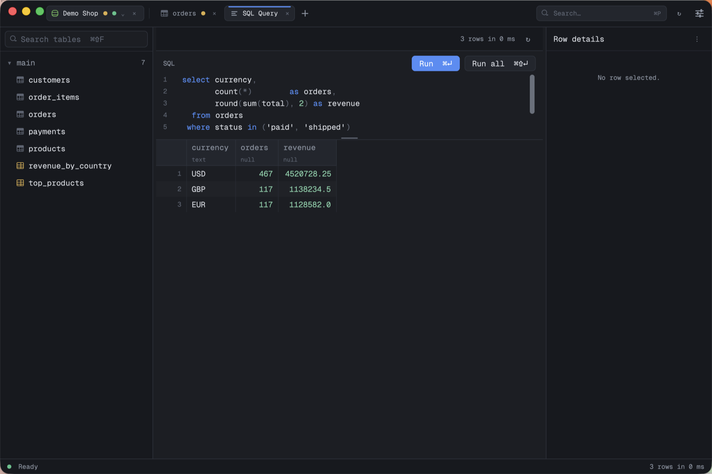

# dbui

A database editor for PostgreSQL, MySQL and SQLite — TablePlus-shaped, written in Rust,
drawn with [GPUI](https://www.gpui.rs).



This is a **starter**: the architecture is complete and the whole path works
end to end — connect, browse the tree, click a table, page through its rows,
run a query, read the result. What it does not have yet is listed under
[Known limits](ARCHITECTURE.md#known-limits), and the layering is set up so
those are additions rather than rewrites.

## A look around

**Edits stage before they commit.** Type over a cell, stage rows for deletion with
`⌘⌫`, and nothing reaches the server: the pending edits are struck through in the
grid and listed and counted in the bar underneath it. `⌘S` sends the whole batch in one
transaction; `⌘Z` throws it away. With several rows selected, the panel on the right
edits all of them at once — `MIXED` marks a column they disagree on, and a field left
reading `MIXED` is written to nobody.



**SQL, with the catalog behind it.** `⌘↵` runs the statement under the caret, `⌘⇧↵`
runs every statement in the buffer, and `⌃Space` completes against the schemas, tables
and columns the connection actually has. Results land in the same typed grid, timed.



## Install

Download the latest `.dmg` from
[Releases](https://github.com/JosueRhea/dbui/releases) and drag dbui to
Applications.

One download covers both Intel and Apple Silicon — the binary is universal, so
there is no wrong choice to make. Builds are signed and notarized by Apple, so
it opens normally: no right-click-to-open, no `xattr` incantation.

dbui updates itself. It checks for a newer release on launch and offers it in
the status bar; nothing downloads or installs without a click. See
[RELEASING.md](RELEASING.md#the-updater) for what it verifies before it will
replace itself.

## Develop locally

**Requirements**

- macOS (GPUI's Metal renderer)
- [Rust](https://rustup.rs) 1.85 or newer (`rustup update` if needed)
- [Docker](https://www.docker.com/) (optional — only for live driver tests)

**Run the app**

```sh
cargo run
```

First build is slow — GPUI is a large dependency — and incremental builds after
that are quick.

**Point it at a database**

The quickest local servers are the ones in `docker-compose.yml`:

```sh
docker compose up -d
```

Then in the app (`⌘N`), add a connection:

| | Postgres | MySQL |
|---|---|---|
| Host | `127.0.0.1` | `127.0.0.1` |
| Port | `55432` | `53306` |
| User | `postgres` | `root` |
| Password | `dbui` | `dbui` |
| Database | `dbui_test` | `dbui_test` |

Ports are non-default so they never collide with a Postgres or MySQL already
running on the machine.

For something to click through — the storefront in the screenshots above — load
`docs/demo.sql` into a database of its own, so it stays clear of the tables the live
driver tests create in `dbui_test`:

```sh
docker compose exec -T postgres psql -U postgres -d postgres -c 'CREATE DATABASE dbui_demo'
docker compose exec -T postgres psql -U postgres -d dbui_demo < docs/demo.sql
```

Then give the connection `dbui_demo` as its database instead of `dbui_test`.

SQLite needs no server: pick it in the connection sheet and give it the path to
a `.db` file. The file has to exist — a path that is not there is reported as
the typo it usually is, rather than quietly becoming an empty database.

**Tests**

```sh
cargo test
```

Nothing here opens a window on your screen or takes over your keyboard: the UI
tests drive a real GPUI window inside the test process, dispatching real
keystrokes, mouse events and repaints.

Unit, UI and SQLite tests need nothing running — the SQLite engine is linked
in, so `crates/dbui-driver/tests/sqlite.rs` exercises a real database file on
every run. The Postgres and MySQL tests need actual servers and are opt-in:

```sh
docker compose up -d
DBUI_LIVE_TESTS=1 cargo test -p dbui-driver
```

## What works

- **Connections** — add, edit and save PostgreSQL, MySQL and SQLite
  connections, with a
  Test button that dials the server without keeping the socket. Saved to
  `~/.config/dbui/connections.json`; passwords are kept in memory only and never
  written.
- **Connection tabs** — several connections open at once, one tab each in the
  titlebar, each owning its own table and SQL tabs. Switching puts back what
  that connection had open; closing a tab closes the socket without forgetting
  the connection. What was open is restored on the next launch, down to the SQL
  you were typing — only the tab that was in front reconnects, the rest wait to
  be clicked.
- **Schema tree** — schemas and their tables, views and materialised views,
  read from `pg_catalog` / `information_schema` / `sqlite_master`. A filter box above it (`⌘⇧F`)
  narrows the tree as you type, unfolding whatever still matches. Right-click a
  table for its menu: open, copy its name, put a `SELECT` in a new SQL tab,
  copy an `INSERT` or `CREATE TABLE` scaffold — and, behind a confirmation that
  makes you type the name, truncate or drop it.
- **Table browser** — click a table for its rows, 500 at a time, with the
  primary key marked in the header and paging through the rest. Click a header
  to sort; the key trails the sort so paging stays stable. Drag a header's edge
  to widen a column. Double-click a cell — or press `↵` — to edit it in place.
  The two that cannot be opened there, a key and a JSON document too tall for a
  one-line box, copy themselves instead: the key lands on the clipboard, and
  the document lands there *and* in the sidebar, selected and ready to take
  again.
- **New rows** — `+ Row` stages a blank row under the others. Columns left
  reading `DEFAULT` are left out of the `INSERT`, so sequences and column
  defaults still fire. It commits in the same transaction as everything else.
- **Foreign keys** — a value that references another table is underlined, and
  the status bar says how to open it. `⌘↵`, `⌥-click`, or the right-click menu
  opens that table filtered to the row it points at. A plain click still just
  selects the cell, because a foreign-key column is an editable column like any
  other. Composite keys are not offered: one cell is not the whole key.
- **Copy a cell, or whole rows** — `⌘C` copies the focused cell on its own,
  because clicking a cell is asking about that cell. With a range of rows
  selected — or with `⌘⇧C` — it copies rows as TSV for a spreadsheet instead
  (or as JSON / `INSERT` statements from the right-click menu), and `⌘V` reads
  that same TSV back in as new staged rows, matching columns by name so rows
  move between tables that share them. `⌘D` duplicates the selection directly,
  leaving keys the table can generate for it to fill in.
  All three stage rows rather than writing them, so `⌘S` still commits and
  `⌘Z` still discards.
- **Query history** — every statement run is kept and searchable with `⌘⇧H`;
  picking one loads it back into the editor rather than running it.
- **Read-only connections** — a per-connection switch that refuses every write
  and says so in the titlebar. It is enforced by the *server*, not just the UI:
  Postgres gets `default_transaction_read_only`, MySQL a read-only session, and
  a SQLite file is opened read-only.
- **Row selection** — click, shift-click or drag a range, ⌘-click to pick rows
  out, `⌘A` for all of them. `⌘⌫` stages the selection for deletion: the rows
  are struck through and listed in the change bubble beside any pending edits,
  and nothing reaches the server until `⌘S` commits the batch in one
  transaction. `⌘Z` throws the whole batch away. Deleting needs a primary key,
  and says so when there is none.
- **Bulk editing** — with several rows selected, the detail sidebar describes
  the whole selection: a column they agree on shows that value, one they
  differ on shows `MIXED`. Type over a field and it is written to every
  selected row — except the ones that already hold it, which are left out of
  the batch. A field left reading `MIXED` is written to nobody, so setting one
  column across forty rows does not quietly rewrite the other thirty-nine.
- **Query editor** — write SQL with highlighting and catalog autocomplete
  (⌃Space). ⌘↵ runs the selection, or the statement under the caret; ⌘⇧↵ runs
  every statement in order. Row-producing results fill the grid (run-all keeps
  the last one); other statements report their affected-row count.
- **Typed grid** — values are coloured by type, numbers right-align, NULL is
  visibly not the string `"NULL"`, and clicking a cell shows it in full in the
  status bar.

## Keys

| Key | |
|---|---|
| `⌘↵` | Run selection, or the statement under the caret |
| `⌘⇧↵` | Run all statements (in the selection, or the whole buffer) |
| `⌃Space` | SQL autocomplete |
| `⌘A` | Select every row (or all the text, in an editor) |
| `⇧↑` / `⇧↓` | Grow the row selection |
| `⌘⌫` | Stage the selected rows for deletion |
| `⌘S` | Commit the staged batch in one transaction |
| `⌘Z` | Discard the staged batch (undo, inside an editor) |
| `⌘⇧F` | Search the schema tree |
| `⌘⇧H` | Query history |
| `⌘C` | Copy the focused cell, or the selected rows as TSV |
| `⌘⇧C` | Copy the selected rows as TSV |
| `⌘V` | Paste rows from the clipboard as new rows |
| `⌘D` | Duplicate the selected rows |
| `↵` | Edit the selected cell in place |
| `⌘↵` / `⌥-click` | Follow the foreign key under the cursor (run, in the editor) |
| `↑` / `↓` | Move the row cursor (the grid scrolls to keep it in view) |
| `←` / `→` | Move the cell cursor along a row |
| `⌘F` | Filter the rows of the open table |
| `⌘P` | Go to table |
| `⌘⇧P` | Command palette |
| `⌘⇧T` | Choose a theme |
| `⌘N` | New connection |
| `⌘R` | Refresh the result (or the catalog) |
| `⌘E` | Open / focus the SQL editor |
| `⌘K` | Clear the editor |
| `⌘[` / `⌘]` | Previous / next page of a table |
| `⌘W` | Close the table / SQL tab |
| `⌃⇥` / `⌃⇧⇥`, `⌘⇧[` / `⌘⇧]` | Next / previous table tab |
| `⌘1` … `⌘9` | Jump to a table tab by position |
| `⌘⌥[` / `⌘⌥]` | Previous / next connection tab |
| `⌘⇧W` | Close the connection tab |
| `⌘+` / `⌘-` / `⌘0` | Zoom the interface in, out, back to actual size |
| `Esc` | Close the sheet, dismiss autocomplete, or leave the editor |

Tabs drag along the strip to reorder, and the order is part of what a restart
puts back. Right-clicking one gives it the rest: close it, close the others,
close everything to its right, or close them all. The same four are in `⌘⇧P`,
aimed at the tab in front.

Closing a tab or a connection that is holding staged changes asks before it
throws them away, and a tab holding some is marked with a dot. A close that
takes several tabs at once asks once, for the batch.

## Layout

```
crates/
  dbui/          the binary; calls dbui_ui::run()
  dbui-ui/       GPUI: window, layout, input
  dbui-app/      use cases, workspace state, the tokio bridge
  dbui-driver/   the DatabaseDriver port + Postgres, MySQL and SQLite adapters
  dbui-domain/   the model everything else speaks in
```

Dependencies point one way, inward, and the manifests enforce it. See
[ARCHITECTURE.md](ARCHITECTURE.md) — worth reading before adding anything, in
particular for where a new engine or a new use case is meant to go.
